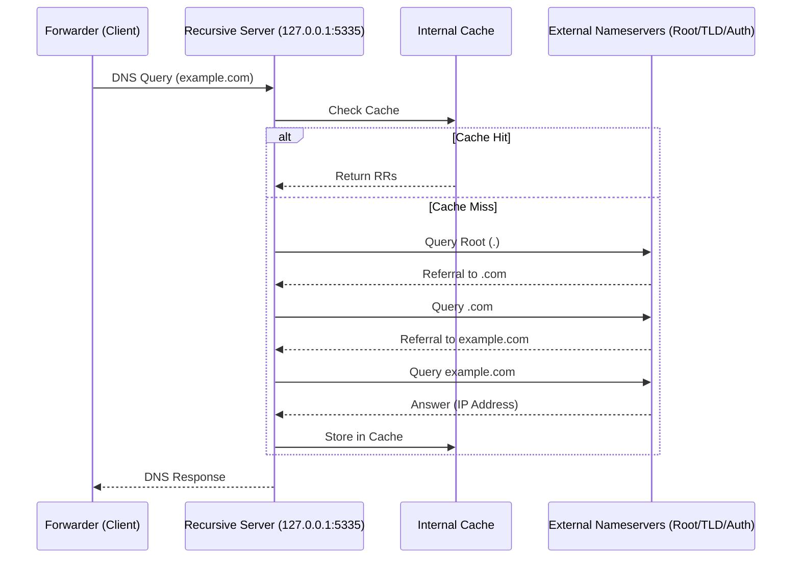

# 工作0：resolver 模块现状分析

## 1. 模块定位
`resolver` 模块目前是一个高度解耦的递归解析器，其设计目标是作为一个独立的服务运行。它不依赖主程序的 Forwarder 逻辑，拥有自己完整的生命周期管理、缓存机制和统计模块。

## 2. 核心架构组成

### 2.1 Server 层 (`server.go`)
- **职责**：处理入站 DNS 请求，解析报文并分发给 Resolver。
- **当前实现**：
  - 支持 **TCP** 和 **Unix Domain Socket** 的 `Transport` 模式。
  - 采用传统的 `Accept` 循环 + `handleConnection` 协程模式。
- **优化点**：
  - ⚠️ **缺乏 UDP 支持**：作为 DNS 服务器，目前主要通过连接导向的协议工作。集成时必须引入 UDP 处理逻辑，以匹配 DNS 转发器的默认行为。

### 2.2 解析引擎 (`resolver.go`)
- **职责**：执行标准的递归迭代查询（Iterative Query）。
- **逻辑流转**：
  1. **缓存预检**：通过 `cache.go` 检查是否有可用缓存。
  2. **根节点获取**：调用 `getRootNameservers()` 获取起始点。
  3. **循环迭代**：
     - 发送非递归查询 (`RecursionDesired = false`)。
     - 处理 **Referral**：当收到 NS 记录但无 Answer 时，提取 NS 的 IP（Glue Records 或递归解析 NS 域名）。
     - 处理 **CNAME**：自动跟随 CNAME 链。
     - 异常处理：处理 RCode (NXDOMAIN, SERVFAIL) 及最大递归尝试次数（默认 15 次）。
- **优化点**：
  - **nameserver 轮试**：目前顺序尝试 NS 列表中的服务器。可以引入简单的 RTT 排序或 Race 机制加速。

### 2.3 缓存系统 (`cache.go`)
- **职责**：高性能内存缓存。
- **特性**：
  - **LRU 淘汰**：使用双向链表 (`container/list`) 实现，超过 `maxSize` 时自动剔除最旧数据。
  - **TTL 敏感**：支持过期自动清理。
- **优化点**：
  - 目前仅为内存缓存，重启后丢失。工作计划中应考虑是否与主程序的磁盘持久化逻辑同步。

---

## 3. 查询处理流程图

## 4. 关键改进点 (用于指导后续任务)

1. **协议补全**：在 `server.go` 中增加对 **UDP** 的支持，这是集成到 `SmartDNSSort` 转发器链路的先决条件。
2. **根数据源切换**：将硬编码的 `getRootNameservers()` 修改为从 `named.cache` 文件动态解析。
3. **日志前缀统一**：注入全局 Logger，确保日志带有 `[REC]` 标签，方便与 `[FWD]` 区分。
4. **并发治理**：在迭代查询中，针对一个域名的多个 NS 出口，可以考虑并发探测以降低冷启动延迟。
5. **配置对接**：目前的 `NewServer` 使用的是 `resolver.Config`。在集成时，需要编写一个转换函数，将主程序的 `config.RecursiveConfig` 映射到这里的配置结构。

---

## 5. 结论
`resolver` 模块的代码质量很高，逻辑非常“标准”。通过补充 UDP 支持和完善文件驱动的 Root Hints 加载，它可以非常完美地承载起“地表最强隐私解析”的任务。
